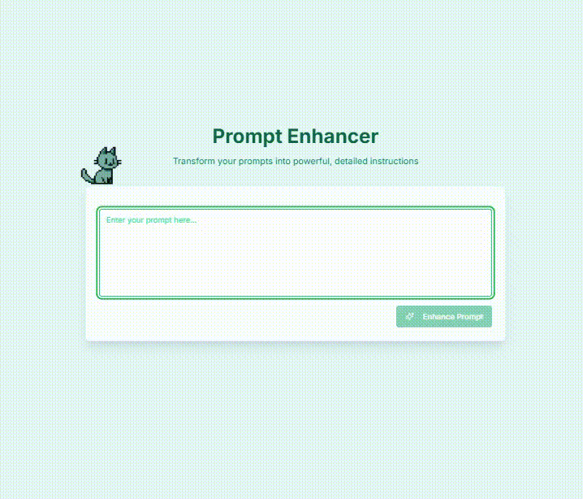

<div align="center">
  <h1>Spiritual</h1>
  <p>A minimal prompt enhancement tool powered by Claude AI</p>
  
  
</div>

## Features

- 🎨 Minimal, clean interface
- 🌙 Dark/light mode with themed mascots
- 🤖 Claude AI-powered prompt enhancement
- ⚡ Real-time streaming responses
- 📱 Fully responsive design

## Community & Contributions

Feel free to use, modify, and enhance this project! Fork it, make it your own, and share your improvements. I'll be happy to review and discuss any updates you create. Let's make prompt enhancement even better together! 🚀
## Prerequisites

- Node.js 
- Anthropic API key
- Next.js

## Installation

1. Clone the repository:
   ```bash
   git clone https://github.com/dxd/spiritual.git
   cd spiritual
   ```

2. Install dependencies:
   ```bash
   npm install
   ```

3. Set up your Anthropic API key by creating a `.env` file:
   ```bash
   echo "ANTHROPIC_API_KEY=your_api_key_here" > .env
   ```

4. Start the development server:
   ```bash
   npm run dev
   ```

## Usage

1. Open your browser and navigate to `http://localhost:3000`.
2. Start enhancing your prompts

## Building for Production

To create a production build, run:
```bash
npm run build
```

Then, start the production server with:
```bash
npm start
```

## License

This project is licensed under the MIT License.


**Built with ❤️ by [dxd](https://x.com/dxd)** & **[zaza](https://github.com/zaa-za)**
**AfterImage**

